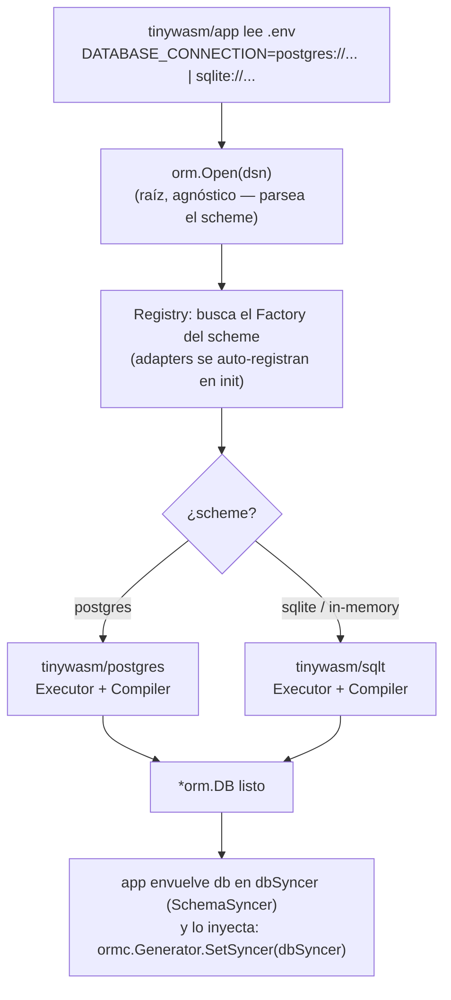
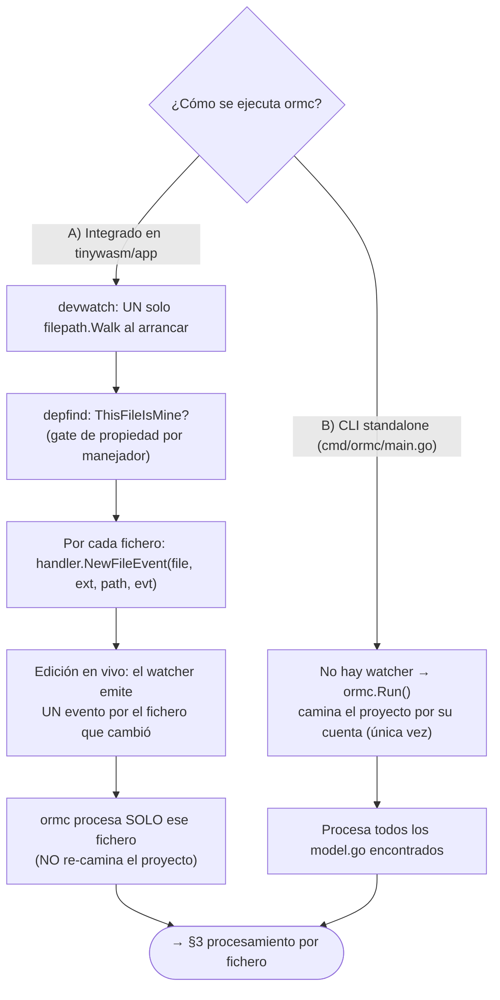
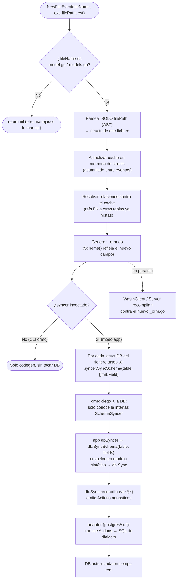
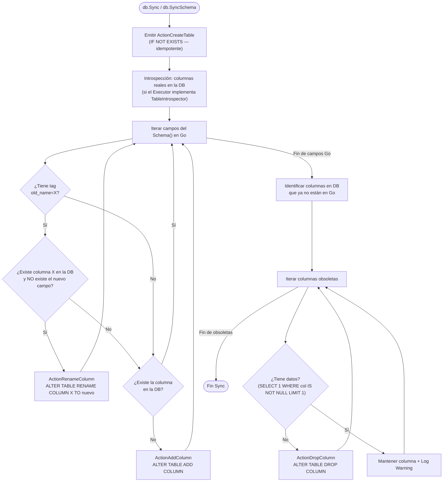

# DB Sync — visión tool-driven (la herramienta sincroniza, no el proyecto)

> El proyecto del usuario importa **solo `orm`** (agnóstico) y **no contiene código de sync**.
> `tinywasm/app` (la herramienta) observa los ficheros y aplica el schema a una DB que **ella** posee.
> `ormc` es **ciego a la base de datos**: opera solo con la interfaz `SchemaSyncer` inyectada.
>
> **Una sola lectura.** Al arrancar, `devwatch` hace **un único `filepath.Walk`** del proyecto y va
> pasando **cada fichero** a los manejadores vía `NewFileEvent`. `ormc` procesa **solo el fichero
> recibido** — nunca re-camina el proyecto. La selección de "qué manejador es dueño de qué fichero"
> ya la resuelve **depfind** (`ThisFileIsMine`). El walk propio solo ocurre en el CLI standalone.

## 1. Setup de conexión (una vez, al arrancar app)

## 2. Dos modos de ejecución de ormc (de dónde vienen los ficheros)

## 3. Procesamiento por fichero (modo app — sin re-walk)

## 4. Reconciliación interna de db.Sync (additiva + introspectiva)

## Quién posee qué

| Capa | Responsabilidad | Conoce la DB |
|------|-----------------|--------------|
| **tinywasm/app** (herramienta) | Lee `.env`, `orm.Open`, construye `*orm.DB`, inyecta `dbSyncer` | Sí (elige motor) |
| **devwatch** | UN walk al arrancar + eventos en vivo; gate depfind por fichero | No |
| **ormc.Generator** | Procesa **el fichero recibido**, regenera `<file>_orm.go`, llama `SchemaSyncer` | **No** (ciego) |
| **orm raíz** | `Open`/`Register`, `SyncSchema`/`Sync`, emite `Action`s | No (agnóstico) |
| **postgres / sqlt** | `init()` registra factory; traduce `Action`s → SQL | Sí (dialecto) |
| **proyecto del usuario** | Define modelos. Importa solo `orm`. | **Sin código de sync** |

> **Nota de eficiencia:** el walk completo (`Run()` / `collectAllStructs`) queda **solo** en el CLI
> standalone. En modo app, cada `NewFileEvent` procesa un fichero y se apoya en el cache + depfind;
> nunca se re-lee el proyecto entero por evento.
