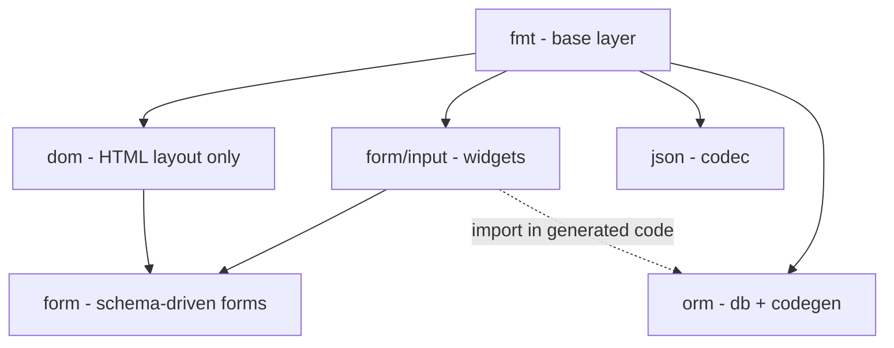
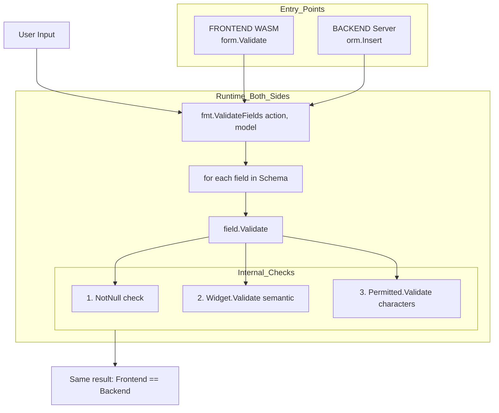

# ORMC Flow — Unified Form Validation (Front + Back)

## Core Principle

**ormc infiere el rol del struct desde los tags de campo — sin directivos de struct.**
Un struct con ≥1 campo `input:` genera widgets (form). Un struct con ≥1 campo `db:` o campo `ID` genera
FieldDB y se sincroniza como tabla (DB). Los roles son aditivos: un struct puede ser form + DB a la vez.
El tag `input:` controla tanto el widget override como si el struct es formulario.

---

## Dependency Graph



**Reglas:**
- dom: solo layout HTML (Div, H1, Button...). NO tiene funciones de formulario.
- form: unica forma de crear formularios. Usa form.New(parentID, &struct).
- form/input: widgets con validacion. Importado por form y por codigo generado.
- orm: no importa form/input en su codigo fuente. Solo el generado (*_orm.go).

---

## Role Inference (from field tags)

```mermaid
graph LR
    subgraph Field_Tags
        inputTag["`input:\"...\"` en algún campo"]
        dbTag["`db:\"...\"` en algún campo o campo `ID`"]
        neither["(sin tags de rol)"]
    end

    inputTag -->|isForm=true| Widgets[Widgets en Schema + import form/input]
    dbTag -->|isDB=true| DB[FieldDB + sync tabla]
    neither -->|codec-only| Codec[Solo ModelName + codec + *List]
```

| Señal en campos | isForm | isDB | Qué se añade |
| :--- | :--- | :--- | :--- |
| ninguna | no | no | solo codec (DTO) |
| `input:` ≠ `"-"` | **si** | no | widgets; no sync tabla |
| `db:` ≠ `"-"` o campo `ID` | no | **si** | FieldDB + sync tabla; sin widgets |
| ambas | **si** | **si** | widgets + FieldDB + sync tabla |

> `input:"-"` excluye ese campo del form pero no cuenta para `isForm`.
> `db:"-"` excluye ese campo de DB y anula la convención `ID`.

---

## Widget Assignment (solo structs con `isForm`)

### Default por Go type

| Go type | Widget default |
| :--- | :--- |
| `string` | `input.Text()` |
| `int`, `int64`, `uint`, etc. | `input.Number()` |
| `float32`, `float64` | `input.Number()` |
| `bool` | `input.Checkbox()` |

### Override con tag `input:`

| Tag | Resultado |
| :--- | :--- |
| _(sin tag)_ | default por Go type |
| `input:"email"` | `input.Email()` (override) |
| `input:"textarea"` | `input.Textarea()` (override) |
| `input:"-"` | sin widget (excluido del form) |
| `input:"email,required,min=5"` | `input.Email()` + Permitted modifiers |
| `input:"required,min=5"` | default por Go type + Permitted modifiers |

---

## ormc Run() Flow

```mermaid
sequenceDiagram
    participant Ormc as orm.Ormc
    participant AST as Parser/AST
    participant Gen as Generator

    Ormc->>Ormc: Run()

    rect rgb(240, 240, 240)
    Note over Ormc: Pass 1: collectAllStructs()
    Ormc->>AST: ParseStruct(structAST)
    Note over AST: Extract tags: db, json, input
    Note over AST: Infer hasForm: ≥1 input: ≠ "-"
    Note over AST: Infer hasDB: ≥1 db: ≠ "-" OR campo ID
    AST->>AST: If isForm: resolve widget per field
    Note over AST: 1. input:"-" → skip
    Note over AST: 2. input:"type" → inputWidgets[type]
    Note over AST: 3. no tag → defaultWidgets[goType]
    Note over AST: 4. parse modifiers (required, min, max...)
    AST-->>Ormc: Build FieldInfo (IsForm, NoDB derived)
    end

    rect rgb(240, 240, 240)
    Note over Ormc: Pass 2: ResolveRelations()
    Ormc->>Ormc: match FK via db:"ref=parent"
    end

    rect rgb(240, 240, 240)
    Note over Ormc: Pass 3: GenerateForFile()
    Ormc->>Gen: Schema() with Widget if isForm
    Ormc->>Gen: Validate() → fmt.ValidateFields()
    Ormc->>Gen: ModelName always; FieldDB + ReadOne/ReadAll if isDB
    Note over Gen: Import form/input only if widgets present
    end

    rect rgb(240, 240, 240)
    Note over Ormc: Pass 4: go get + go mod tidy
    end
```

---

## Validation Flow (Runtime — Same Code Front + Back)



---

## Tag System (Final)

No struct-level directives needed. Role is inferred from field tags:

```go
type User struct {
    ID         string  `db:"pk"`                       // ID convention → isDB=true
    Email      string  `input:"email"`                 // input: → isForm=true; override → input.Email()
    Phone      string  `input:"phone"`                 // override → input.Phone()
    BirthDate  string  `input:"date"`                  // override → input.Date()
    Bio        string  `input:"textarea"`              // override → input.Textarea()
    Nick       string  `input:"required,min=3,max=20"` // default text + modifiers
    Age        int     `db:"not_null"`                 // int → input.Number() default
    Active     bool                                    // bool → input.Checkbox() default
    InternalID string  `input:"-"`                     // excluded from form; no Widget
}
// Result: isForm=true (has input: fields), isDB=true (ID convention) → full: widgets + FieldDB + sync
```

**Rules:**
- `input:"type"` → explicit widget override
- `input:"type,modifier,..."` → explicit widget + Permitted rules
- `input:"modifier,..."` → Go type default widget + Permitted rules
- `input:"-"` → no widget (excluded from form)
- No `input:` tag → Go type default widget
- `db:"not_null"` → NotNull (also settable via `input:"required"`)

---

## Source Tag Cleanup (rewriteModelTags)

ormc rewrites model.go in-place before/after generation:

| BEFORE | AFTER |
| :--- | :--- |
| `json:"email"` | (removed — redundant with field name) |
| `json:"email,omitempty"` | `json:",omitempty"` |
| `json:",omitempty"` | `json:",omitempty"` (unchanged) |
| `json:"-"` | `json:"-"` (unchanged) |
| `form:"email"` | (removed — legacy tag) |
| `validate:"email,required,min=5"` | (removed — legacy tag) |
| `input:"date"` | `input:"date"` (unchanged) |
| `db:"pk"` | `db:"pk"` (unchanged) |

---

## Custom Inputs (web/input/) — Future

```
web/input/
├── currency.go     ← func Currency() fmt.Widget
└── colorpicker.go  ← func Colorpicker() fmt.Widget

ormc AST-scans this directory:
  1. Finds func *() fmt.Widget
  2. Adds to inputWidgets map with priority over stdlib
  3. Generated code: webinput.Currency()
  4. Import: webinput "yourmodule/web/input"
```

Custom inputs take priority: if project defines `Email()` in web/input/,
it overrides stdlib `input.Email()`.
