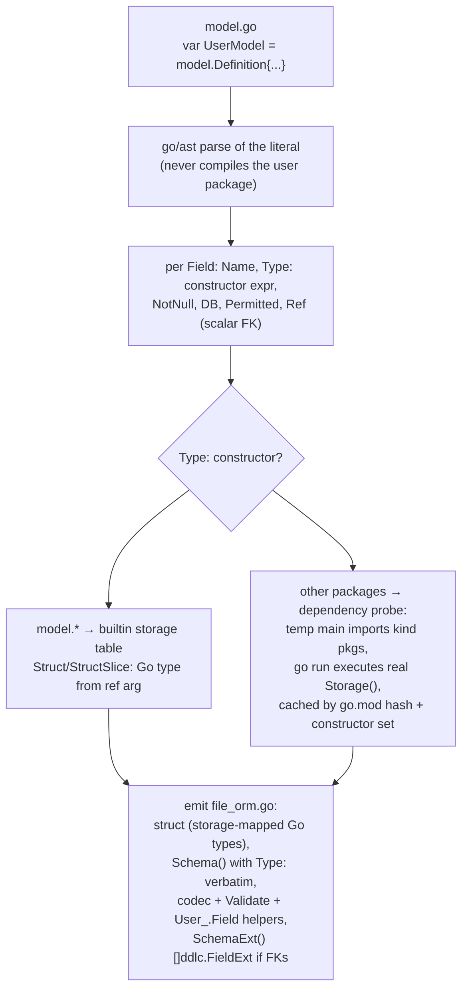
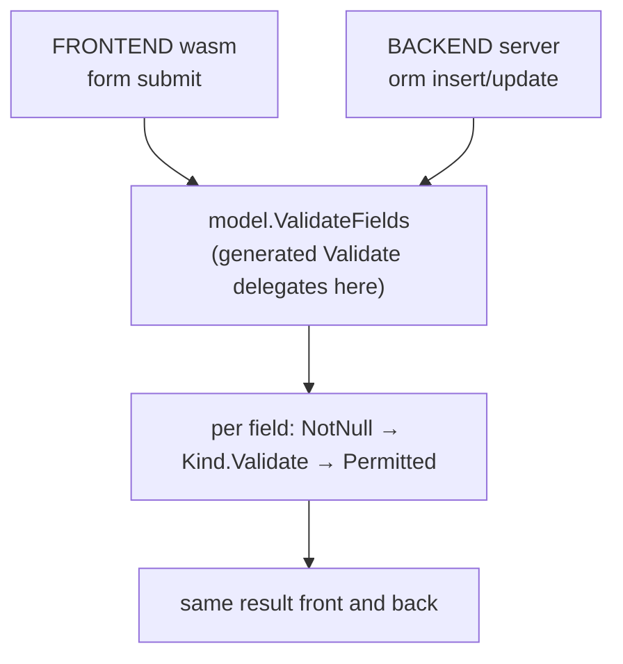

# ORMC Flow — Definition → generated code

> Phase-B flow (Kind unification): the input is a hand-written
> `model.Definition` literal; roles and storage derive from the `Type:`
> constructors. The old struct-tag inference (`db:`/`input:` tags, widget
> defaults per Go type) is GONE. Contract details:
> [../ARCHITECTURE.md](../ARCHITECTURE.md); storage decision:
> [../DESIGN.md](../DESIGN.md); DB sync: [DB_SYNC.md](DB_SYNC.md).

## Generation flow

## Hard generation errors (never guess)

| Input | Error |
|---|---|
| field without `Type:` | kind required (fail-closed guard) |
| `Widget:` present | removed by Kind unification — declare the kind in `Type:` |
| `Ref:` next to `Struct(ref)`/`StructSlice(ref)` | contradiction: composition ref travels in the constructor |
| composition constructor with missing/nil ref | ref required |
| constructor argument referencing the scanned package | probe cannot import the user's package — literals only |
| custom kind in the same package as its Definitions | custom kinds live in their own package |
| probe compile/run failure | surfaces compiler output verbatim |
| probed kind returning struct/structslice storage | custom composition kinds unsupported |

## Runtime validation (unchanged, fail-closed)

